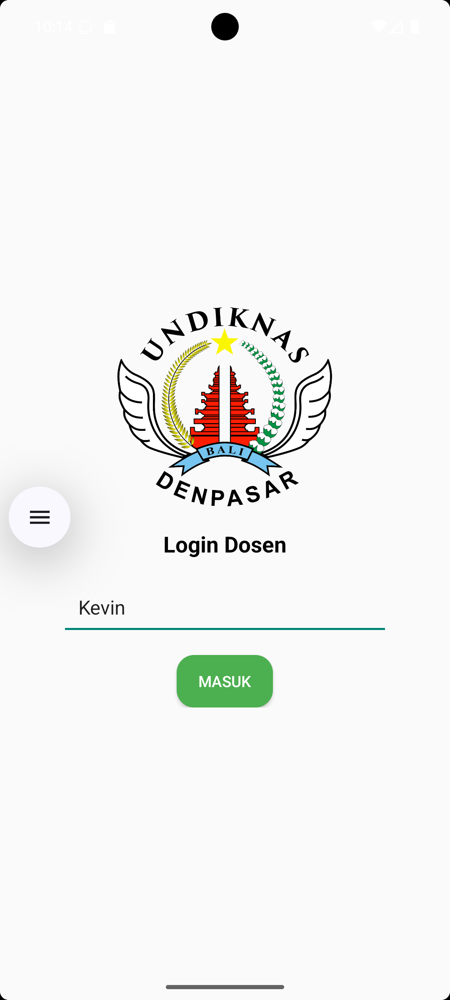
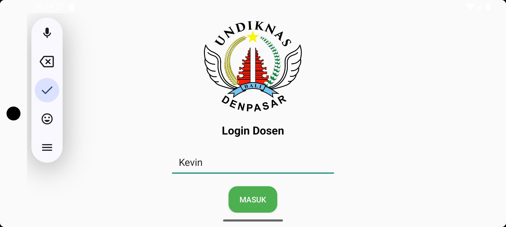
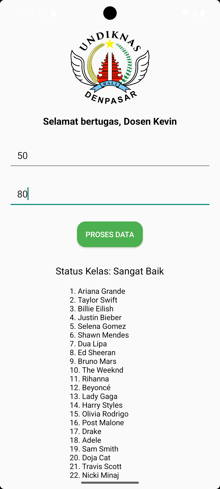
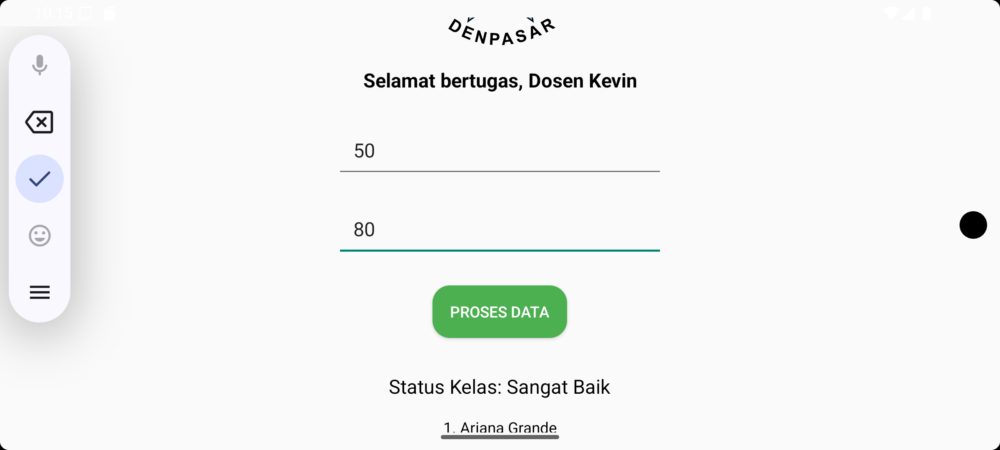

# UTS Pemrograman Seluler - Aplikasi Generator Lembar Penilaian

## Identitas Mahasiswa
- **Nama Lengkap:** Cevyn Eduard Imanuel Dapa Talu
- **NIM:** 42430055
- **Program Studi:** Teknologi Informasi

## Deskripsi Aplikasi
Aplikasi ini dikembangkan sebagai bagian dari Ujian Tengah Semester (UTS) untuk mata kuliah Pemrograman Seluler. Tujuannya adalah untuk memperlihatkan kemampuan mahasiswa dalam menguasai materi paruh pertama semester, dengan fitur sebagai berikut:

1. **Modul 2 & 3:** Mendesain antarmuka pengguna (UI/UX) yang responsif, termasuk dukungan tampilan *Portrait* dan *Landscape* menggunakan folder `layout-land`.
2. **Modul 4:** Implementasi navigasi antar halaman serta pengiriman data menggunakan `Intent` (mengirim nama dosen dari halaman login ke panel generator).
3. **Modul 5:** Penerapan *Control Flow*:
   - Menggunakan percabangan `If-Else` untuk menentukan status kelas berdasarkan rata-rata nilai.  
   - Memanfaatkan perulangan `For Loop` untuk menghasilkan daftar absen secara otomatis.  
   - Daftar absen menampilkan nama dari file `names.txt` yang tersimpan di folder `assets`.

Fitur tambahan yang ada pada aplikasi ini mencakup:
- **Halaman Login:** Menampilkan logo universitas, input untuk nama dosen, dan tombol masuk. 
- **Panel Generator:** Menampilkan sapaan untuk dosen, input jumlah mahasiswa dan rata-rata nilai, tombol proses data, serta output status kelas dan daftar absen.

## Screenshot Aplikasi

### 1. Halaman Login (Responsif)
| Mode Portrait | Mode Landscape |
| :---: | :---: |
|  |  |

### 2. Halaman Panel Generator
| Input Data | Hasil Generate (If-Else & Loop) |
| :---: | :---: |
|  |  |
